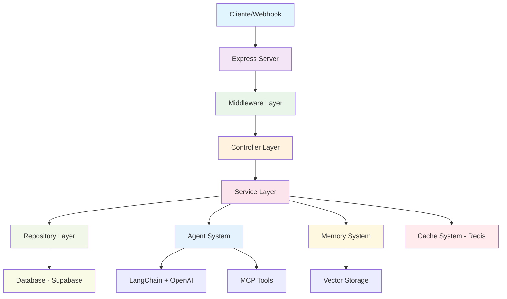

# 📋 Guia Completo: Arquitetura Avançada do Pareazul Assistant Server

## 🎯 Objetivo Geral

Construir um servidor Node.js/Express robusto e escalável que replique e expanda todas as funcionalidades do fluxo atual do n8n, implementando:

- Sistema completo de agentes de IA conversacionais
- Gerenciamento avançado de sessões e memória
- Integração com múltiplas APIs externas
- Sistema de transcrição de áudio
- Cache inteligente com Redis
- Persistência robusta com Supabase
- Arquitetura modular e type-safe

---

## 🏛️ Arquitetura Geral

### Visão Macro do Sistema



### Principais Camadas

1. **API Layer**: Express + Middlewares + Routes
2. **Business Layer**: Services + Validation
3. **Agent Layer**: IA Agents + Tools + Memory
4. **Data Layer**: Repositories + Cache + Database
5. **Integration Layer**: External APIs + MCP + Webhooks

---

## 📂 Estrutura de Pastas Detalhada

### Árvore Completa do Projeto

```
src/
├── 🤖 agents/                 # Sistema de Agentes IA
│   ├── calculator/            # Agente calculadora (já implementado)
│   │   ├── calculator.agent.ts
│   │   ├── calculator.index.ts
│   │   ├── calculator.tools.ts
│   │   ├── calculator.schemas.ts
│   │   └── calculator.prompt.ts
│   ├── chat/                  # Agente principal de conversa
│   │   ├── chat.agent.ts      # Configuração do agente
│   │   ├── chat.index.ts      # Interface principal
│   │   ├── chat.tools.ts      # Ferramentas específicas
│   │   ├── chat.schemas.ts    # Validações Zod
│   │   └── chat.prompt.ts     # Templates de prompt
│   ├── transcription/         # Agente de transcrição
│   │   ├── transcription.agent.ts
│   │   ├── transcription.index.ts
│   │   ├── transcription.tools.ts
│   │   ├── transcription.schemas.ts
│   │   └── transcription.prompt.ts
│   └── base/                  # Classes base para agentes
│       ├── base.agent.ts
│       ├── base.schemas.ts
│       └── agent.interface.ts
├── 💼 services/               # Lógica de Negócio
│   ├── session.service.ts     # Gerenciamento de sessões
│   ├── memory.service.ts      # Sistema de memória + vetorização
│   ├── transcription.service.ts
│   ├── external-api.service.ts
│   ├── webhook.service.ts
│   ├── notification.service.ts
│   └── cache.service.ts       # Abstrações para Redis
├── 🗃️ repositories/          # Acesso a Dados
│   ├── base.repository.ts     # Classe base para repos
│   ├── chat.repository.ts     # assistant_chat_details
│   ├── message.repository.ts  # assistant_chat_messages
│   ├── user.repository.ts
│   ├── session.repository.ts
│   └── memory.repository.ts   # Armazenamento de memória/vectors
├── 🛣️ routes/                # Roteamento (já implementado)
│   ├── index.ts
│   ├── calculator.route.ts
│   ├── chat.route.ts
│   ├── transcription.route.ts
│   └── webhook.route.ts
├── 🎮 controllers/           # Controladores (já implementado)
│   ├── calculator.controller.ts
│   ├── chat.controller.ts
│   ├── transcription.controller.ts
│   └── webhook.controller.ts
├── 🛡️ middleware/            # Middlewares
│   ├── auth.middleware.ts     # Autenticação (HeaderAuth do n8n)
│   ├── validation.middleware.ts
│   ├── rate-limit.middleware.ts
│   ├── error-handler.middleware.ts
│   ├── cors.middleware.ts
│   └── logging.middleware.ts
├── 🔧 utils/                 # Utilitários
│   ├── redis.util.ts         # Cliente Redis configurado
│   ├── supabase.util.ts      # Cliente Supabase
│   ├── logger.util.ts        # Sistema de logs
│   ├── crypto.util.ts        # UUIDs, hashing
│   ├── validation.util.ts
│   ├── vector.util.ts        # Operações vetoriais
│   └── http.util.ts          # Cliente HTTP configurado
├── 📝 types/                 # Tipos TypeScript
│   ├── common.types.ts
│   ├── chat.types.ts
│   ├── session.types.ts
│   ├── webhook.types.ts
│   ├── memory.types.ts
│   ├── agent.types.ts
│   └── api.types.ts
├── ⚙️ config/               # Configurações
│   ├── app.config.ts         # Configurações gerais
│   ├── database.config.ts    # Supabase
│   ├── redis.config.ts       # Redis
│   ├── openai.config.ts      # OpenAI/LangChain
│   ├── logging.config.ts
│   └── environment.config.ts # Variáveis de ambiente
├── 🔨 tools/                # Ferramentas para Agentes
│   ├── math.tool.ts          # Já implementado
│   ├── mcp.tool.ts           # Integração MCP
│   ├── external-api.tool.ts  # APIs externas
│   ├── database.tool.ts      # Operações de banco
│   └── transcription.tool.ts
├── 🧪 tests/                # Testes
│   ├── unit/
│   ├── integration/
│   └── e2e/
└── 📚 docs/                 # Documentação
    ├── api.md
    ├── architecture.md
    └── deployment.md
```

---

## 🧠 Sistema de Memória e Armazenamento

### Estratégias de Armazenamento para Chat e Memória

#### 1. **Memória de Curto Prazo (Buffer Window)**
- **Onde**: Redis
- **O que**: Últimas N mensagens da conversa
- **Estrutura**: Lista circular com TTL
- **Uso**: Contexto imediato para o agente

#### 2. **Memória de Longo Prazo (Persistente)**
- **Onde**: Supabase (assistant_chat_messages)
- **O que**: Histórico completo da conversa
- **Estrutura**: Tabela relacional normalizada
- **Uso**: Análise, auditoria, recuperação

#### 3. **Memória Vetorizada (Semantic Search)**
- **Onde**: Opções:
  - Redis com RedisSearch
  - Supabase com pg_vector
  - Pinecone/Weaviate (external)
- **O que**: Embeddings das mensagens para busca semântica
- **Uso**: Recuperação de contexto relevante

#### 4. **Cache de Sessão**
- **Onde**: Redis
- **O que**: Metadados da sessão, assistant_id, estado
- **Estrutura**: Hash com TTL
- **Uso**: Performance e validações

### Implementação Recomendada

#### **Arquitetura Híbrida**

```typescript
// Conceito da implementação
interface MemorySystem {
  // Buffer Window - Redis
  shortTermMemory: {
    store: (sessionId: string, messages: Message[]) => Promise<void>
    retrieve: (sessionId: string, limit: number) => Promise<Message[]>
    clear: (sessionId: string) => Promise<void>
  }

  // Persistent Storage - Supabase
  longTermMemory: {
    store: (message: Message) => Promise<void>
    retrieveHistory: (sessionId: string, limit?: number) => Promise<Message[]>
    search: (query: string) => Promise<Message[]>
  }

  // Vector Memory - Escolha baseada em necessidade
  vectorMemory: {
    embed: (message: Message) => Promise<number[]>
    store: (messageId: string, vector: number[]) => Promise<void>
    similaritySearch: (query: string, limit: number) => Promise<Message[]>
  }

  // Session Cache - Redis
  sessionCache: {
    setAssistantId: (userId: string, assistantId: string) => Promise<void>
    getAssistantId: (userId: string) => Promise<string | null>
    setSessionMeta: (sessionId: string, meta: SessionMeta) => Promise<void>
    getSessionMeta: (sessionId: string) => Promise<SessionMeta | null>
  }
}
```

---

## 🔄 Fluxo de Processamento Principal

### Replicando o Fluxo do n8n

#### 1. **Recepção da Mensagem (Webhook)**
```
Input: POST /webhook/mensagem-assistente
↓
Middleware: Auth, Validation, Rate Limiting
↓
Controller: Extração e formatação inicial
↓
Service: Lógica de processamento
```

#### 2. **Validações e Verificações**
```
Verificar se possui assistant_id (Cache/Redis)
↓
Se não possui → Gerar novo UUID
↓
Verificar se sessão existe (Database)
↓
Se não existe → Criar nova sessão
↓
Atualizar chats anteriores (inativar)
```

#### 3. **Processamento da Mensagem**
```
Registrar mensagem do usuário (Database)
↓
Carregar contexto/memória (Redis + Database)
↓
Invocar agente IA (LangChain + Tools)
↓
Processar resposta
↓
Registrar resposta da IA (Database)
```

#### 4. **Pós-processamento**
```
Atualizar cache (Redis)
↓
Notificar APIs externas (Webhooks)
↓
Retornar resposta formatada
```

---

## 🤖 Sistema de Agentes

### Estrutura Padrão dos Agentes

#### **Padrão de Nomenclatura** (conforme definido)
```
agents/[nome]/
├── [nome].agent.ts     # Configuração do AgentExecutor
├── [nome].index.ts     # Interface pública
├── [nome].tools.ts     # Ferramentas específicas
├── [nome].schemas.ts   # Validações Zod
└── [nome].prompt.ts    # Templates de prompt
```

#### **Interface Base para Agentes**
```typescript
// Conceito da interface
interface BaseAgent {
  name: string
  description: string
  invoke: (input: string, context?: AgentContext) => Promise<string>
  tools: Tool[]
  memory?: MemoryBuffer
  config: AgentConfig
}

interface AgentContext {
  sessionId: string
  userId: string
  metadata: Record<string, any>
}
```

### Agentes Principais

#### 1. **Chat Agent** (Principal)
- **Função**: Conversação geral + orquestração
- **Tools**: MCP, Database, External APIs
- **Memory**: Buffer Window + Vector Search
- **Prompt**: Personalidade + Instruções específicas

#### 2. **Calculator Agent** (Já implementado)
- **Função**: Operações matemáticas
- **Tools**: Math operations
- **Memory**: Não necessária
- **Prompt**: Foco em precisão numérica

#### 3. **Transcription Agent**
- **Função**: Áudio para texto
- **Tools**: Whisper API, File processing
- **Memory**: Cache de transcrições
- **Prompt**: Formatação e correção

---

## 🔌 Integrações Externas

### MCP (Model Context Protocol)
- **Implementação**: LangChain MCP Client
- **Endpoint**: Configurable via environment
- **Tools**: Dynamic tool loading
- **Error Handling**: Fallback strategies

### APIs Pareazul
- **Authentication**: API Key based
- **Rate Limiting**: Configurable limits
- **Retry Logic**: Exponential backoff
- **Monitoring**: Request/response logging

### Supabase Integration
- **Real-time**: Subscriptions para mudanças
- **Row Level Security**: Políticas por usuário
- **Triggers**: Database-level automations
- **Backup**: Automated strategies

### Redis Integration
- **Clustering**: Support for Redis Cluster
- **Persistence**: RDB + AOF
- **Monitoring**: Memory usage + performance
- **Failover**: Sentinel configuration

---

## 🛡️ Segurança e Performance

### Segurança
- **Authentication**: HeaderAuth (replicando n8n)
- **Rate Limiting**: Por usuário/IP
- **Input Validation**: Zod schemas everywhere
- **SQL Injection**: Parameterized queries
- **XSS Protection**: Input sanitization
- **CORS**: Configurable origins

### Performance
- **Caching**: Multi-layer strategy
- **Connection Pooling**: Database connections
- **Compression**: Response compression
- **CDN**: Static assets
- **Monitoring**: APM integration

---

## 📊 Monitoramento e Logging

### Sistema de Logs
- **Levels**: DEBUG, INFO, WARN, ERROR
- **Structure**: JSON structured logs
- **Rotation**: Daily rotation + compression
- **Storage**: Local files + external service

### Métricas
- **API**: Response times, error rates
- **Database**: Query performance, connections
- **Redis**: Memory usage, hit rates
- **AI**: Token usage, response times

### Health Checks
- **Endpoints**: /health, /ready
- **Dependencies**: Database, Redis, External APIs
- **Alerting**: Automated notifications

---

## 🚀 Deployment e DevOps

### Environment Management
- **Local**: Docker Compose
- **Staging**: Container orchestration
- **Production**: Kubernetes/Docker Swarm
- **Configuration**: Environment-specific configs

### CI/CD Pipeline
- **Testing**: Unit, Integration, E2E
- **Building**: Multi-stage Docker builds
- **Deployment**: Rolling updates
- **Rollback**: Automated rollback strategies

---

## 📋 Próximos Passos (Roadmap)

### Fase 1: Infraestrutura Base (Semana 1-2)
1. **Setup inicial**: Redis + Supabase configurations
2. **Base repositories**: Implementação das classes base
3. **Middleware system**: Auth, validation, error handling
4. **Logging system**: Estruturado e configurável

### Fase 2: Sistema de Memória (Semana 2-3)
1. **Memory Service**: Implementação híbrida
2. **Session Management**: Cache + persistência
3. **Vector Storage**: Escolha e implementação
4. **Integration tests**: Testes de integração

### Fase 3: Chat Agent Principal (Semana 3-4)
1. **Chat Agent**: Implementação completa
2. **MCP Integration**: Tools dinâmicas
3. **External APIs**: Integração com Pareazul
4. **Memory Integration**: Contexto inteligente

### Fase 4: Transcription System (Semana 4-5)
1. **Audio processing**: Upload e validação
2. **Whisper integration**: Transcrição de áudio
3. **Transcription Agent**: Pós-processamento
4. **File management**: Storage e cleanup

### Fase 5: Webhook System (Semana 5-6)
1. **Webhook processing**: Replicar fluxo n8n
2. **External notifications**: APIs Pareazul
3. **Error handling**: Retry mechanisms
4. **Performance optimization**: Caching strategies

### Fase 6: Production Ready (Semana 6+)
1. **Monitoring**: APM e alertas
2. **Security hardening**: Penetration testing
3. **Performance tuning**: Load testing
4. **Documentation**: API docs + deployment guides

---

## 🎯 Considerações Técnicas Importantes

### Escalabilidade
- **Horizontal scaling**: Stateless services
- **Database sharding**: User-based partitioning
- **Cache distribution**: Redis clustering
- **Load balancing**: Round-robin + health checks

### Manutenibilidade
- **Code standards**: ESLint + Prettier
- **Documentation**: Inline + external docs
- **Testing**: >80% coverage target
- **Refactoring**: Regular code reviews

### Observabilidade
- **Distributed tracing**: Request correlation
- **Error tracking**: Automated error reporting
- **Performance monitoring**: Real-time metrics
- **User analytics**: Usage patterns

---

## 📚 Padrões e Convenções

### Naming Conventions
- **Files**: kebab-case (calculator.service.ts)
- **Classes**: PascalCase (CalculatorService)
- **Functions**: camelCase (invokeAgent)
- **Constants**: UPPER_SNAKE_CASE (MAX_RETRIES)

### Error Handling
- **Custom exceptions**: Domain-specific errors
- **Error codes**: Standardized error codes
- **Logging**: Structured error logging
- **Recovery**: Graceful degradation

### API Design
- **RESTful**: Standard HTTP methods
- **Versioning**: /v1/ prefix
- **Pagination**: Cursor-based
- **Rate limiting**: Standard headers

---

*Este documento serve como a base fundamental para todo o desenvolvimento do Pareazul Assistant Server. Deve ser atualizado conforme o projeto evolui e novas necessidades surgem.*
